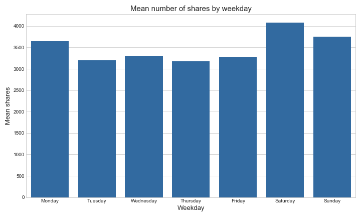

# Online News Popularity Classification Task

Source of the data I used:  [UCI Machine Learning Repository - Online News Popularity](https://archive.ics.uci.edu/ml/datasets/Online+News+Popularity).

Original data includes 60 attributes of an article posted online on Mashable.com and 'target' which is number of shares of that article. I've transformed athe target from continous number to a binary variable. By splitting value I chose 1400 which is a median of number of shares.  53,6% of articles had 1400 or more shares and the rest was below that number.

This was a **binary classification task** in which I had to determine if and article got at least 1400 shares. I wanted to use few different machine learning algorithms to compare their accuracy on that data. I chose to use: **Decision Tree**, **Random Forests** and **Multi Layer Perceptron**. To optimize models I found best combinations of hyperparameters using **GridSearchCV**.

I also wanted to make some of my own variables based on the ones that were in the original data and check if it improves accuracy. Finally I used 45 variables from original data and 12 that I made on my own. These were for example: number of articles posted that day, ratio of number of tokens in content to number of tokens in title, ratio of links to other Mashable articles to all links in the content.

From the source, with data, you can get [OnlineNewsPopularity.names](../master/OnlineNewsPopularity.names) file in which we can read that authors got best score of 67% accuracy and 0.73 AUC. Their best models was Random Forest Classifier. 
The best I got is 67,03% accuracy which is the same as authors score. I got AUC of 0,696 which is also pretty the same as author's.

Main file with code is [news_popularity.ipynb](../master/news_popularity.ipynb). In there you can find preparing data, making charts, building models and evaluating them. File [Analiza.ipynb](../master/Analiza.ipynb) is only for analysis and testing things.

## Technologies used:
- Python 3
- Jupyter Notebook
- pandas 
- matplotlib
- seaborn
- sci-kit learn

## Performance of built models on data with added variables 
(these had better accuracy than models without added variables)
I evaluated models with other indicator such as: Specificity, Sensitivity, Lift, AUC but I show here only Accuracy. For more you can go [here](../master/wyniki) (in polish).

Decision Tree: 
Train Accuracy - 66,96%
Test Accuracy - 64,77%

Random Forest:
Train Accuracy - 69,94%
Test Accuracy - 67,03%

Neural network:
Train Accuracy - 68,92%
Test Accuracy - 66,77%

## Some plots from the analysis

<h4>Analysing number of shares by category of an article</h4>

<h4>Analysing number of shares by weekday</h4>

<h4>Shares of an article vs number of articles published that day</h4>

<h4>ROC Curve</h4>
ROC on the right is from Random Forest Classifier build on data with added variables. We can see that there might be little overfitting but this model performed beter than one without added variables.

<h4>Importance of variables taken from Random Forest (left - without added variables vs right - with added ones</h4>
We can see that some of added ones are the most important on the right chart (dc_is_world_enter, n_art_in_day)

